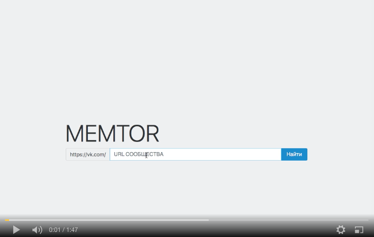

# memtor v0.1

## Описание
[memtor](http://memtor.ml) -- это веб-помощник smm-специалиста, который помогает отслеживать локальные тренды для создания вирусного контента.
 
Данный проект был создан в рамках хакатона muzis: [AdHack](http://adhack.muzis.ru)
 

## Функции и юзкейсы
1. Выделение основных тем
2. Подборка актуальных мемов
3. Локальная и точечная реклама
4. Полезная статистика по группам ВК

## Links
[Word2vec model on Russian Wikipedia together with Russian National Corpus](http://ling.go.mail.ru/static/models/ruwikiruscorpora.model.bin.gz)
 
[Презентация проекта](https://disk.yandex.ru/client/disk/Public/memtor)
